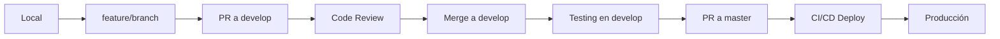

# ⚠️ REGLAS ESTRICTAS DE ARQUITECTURA DEL SERVIDOR

**DOCUMENTO INMUTABLE**
**Versión**: 1.0
**Fecha**: 2025-11-28
**Baseline**: v0.0.1-production-baseline

---

## 🔴 REGLA FUNDAMENTAL

**NUNCA MODIFICAR DIRECTAMENTE EL SERVIDOR DE PRODUCCIÓN**

Todo cambio DEBE pasar por Git Flow → GitHub Actions → Deploy Automático

---

## 📐 ARQUITECTURA INMUTABLE

### **Stack de Producción (NO CAMBIAR)**

```yaml
Servidor: 23.105.176.45
OS: Linux
Usuario: root

Frontend:
  Framework: Astro 5.7.4 (SSR)
  Process Manager: PM2
  Process Name: astro-ultimamilla
  Puerto: 4321
  Version: 0.0.1

Backend:
  CMS: Directus 10.8.3
  Database: PostgreSQL 15 (Docker)
  Cache: Redis 7 (Docker)
  Puerto DB: 5432

Web Server:
  Nginx (Reverse Proxy)
  Puertos: 80/443
  SSL: Let's Encrypt

Control Panel:
  CyberPanel: https://23.105.176.45:8090/
```

### **Servicios en Producción (PROTEGIDOS)**

| Servicio | URL | Estado Requerido |
|----------|-----|------------------|
| Ultima Milla | www.ultimamilla.com.ar | ✅ DEBE estar online 24/7 |
| SGI System | sgi.ultimamilla.com.ar | ✅ DEBE estar online 24/7 |
| UMBot | www.umbot.com.ar | ✅ DEBE estar online 24/7 |
| Vivero Los Cocos | viveroloscocos.com.ar | ✅ DEBE estar online 24/7 |
| CyberPanel | https://23.105.176.45:8090/ | ✅ DEBE estar online 24/7 |

**REGLA**: Cualquier cambio que cause downtime de estos servicios está **PROHIBIDO**

---

## 🚫 PROHIBICIONES ABSOLUTAS

### **1. NO Tocar Archivos de Configuración en Producción**

```bash
❌ PROHIBIDO editar directamente:
/root/fumbling-field/.env
/root/fumbling-field/directus-admin/.env
/root/fumbling-field/astro.config.mjs
/root/fumbling-field/ecosystem.config.js
/etc/nginx/nginx.conf
```

**REGLA**: Toda configuración se hace en Git → PR → Deploy automático

### **2. NO Modificar el Git del Servidor Manualmente**

```bash
❌ PROHIBIDO ejecutar en producción:
git pull (sin supervisión)
git merge
git reset --hard
git checkout (cambiar ramas)
git stash drop
rm -rf .git
```

**REGLA**: Git en producción es READ-ONLY excepto para CI/CD

### **3. NO Reiniciar Servicios Sin Protocolo**

```bash
❌ PROHIBIDO ejecutar sin supervisión:
pm2 delete astro-ultimamilla
pm2 stop astro-ultimamilla (excepto mantenimiento planificado)
docker-compose down (base de datos)
service nginx stop
reboot
```

**REGLA**: Reiniciar servicios SOLO con protocolo de emergencia documentado

### **4. NO Instalar/Desinstalar Paquetes Globalmente**

```bash
❌ PROHIBIDO ejecutar en producción:
npm install -g <paquete>
apt-get remove <paquete> (sin verificación)
pip install <paquete>
docker rmi (imágenes en uso)
```

**REGLA**: Nuevas dependencias deben agregarse en Git → CI/CD verifica → Deploy

### **5. NO Modificar Permisos o Propietarios**

```bash
❌ PROHIBIDO ejecutar sin análisis:
chmod 777 -R /root/fumbling-field/
chown -R usuario:grupo /root/fumbling-field/
```

**REGLA**: Permisos actuales están optimizados, NO modificar

### **6. NO Borrar Logs Sin Rotación**

```bash
❌ PROHIBIDO ejecutar:
rm -rf /root/.pm2/logs/*
rm /var/log/nginx/*.log
truncate -s 0 /var/log/* (sin rotación)
```

**REGLA**: Usar logrotate para gestión de logs

---

## ✅ FLUJO DE TRABAJO OBLIGATORIO

### **Para Cualquier Cambio de Código**



**PASOS OBLIGATORIOS**:

1. **Crear branch desde develop**
   ```bash
   git checkout develop
   git pull origin develop
   git checkout -b feature/nombre-cambio
   ```

2. **Desarrollar y commitear con convención**
   ```bash
   git commit -m "feat(scope): descripción"
   ```

3. **Push y crear PR a develop**
   ```bash
   git push origin feature/nombre-cambio
   # Crear PR en GitHub
   ```

4. **Después de merge a develop, PR a master**
   ```bash
   # GitHub Actions automáticamente deploya
   ```

**REGLA**: NUNCA pushear directamente a `master` o modificar producción manualmente

---

## 🛡️ PROTOCOLOS DE EMERGENCIA

### **Si el Sitio Cae - SOLO ESTE PROCEDIMIENTO**

```bash
# 1. Verificar estado
ssh ultimamilla
pm2 list

# 2. Si PM2 está caído, reiniciar
pm2 restart astro-ultimamilla

# 3. Si hay error, rollback a baseline
cd /root/fumbling-field
git stash  # Guardar cambios locales
git checkout v0.0.1-production-baseline
pm2 restart astro-ultimamilla

# 4. Verificar
curl -I https://www.ultimamilla.com.ar
# Debe retornar: HTTP/2 200

# 5. Reportar incidente en GitHub Issues
```

**REGLA**: En emergencia, SIEMPRE hacer rollback a baseline, NO intentar "arreglar en caliente"

### **Si Hay Conflicto de Git en Servidor**

```bash
# ÚNICO procedimiento permitido:
cd /root/fumbling-field
git stash save "conflicto-$(date +%Y%m%d_%H%M%S)"
git pull origin master
# SI hay conflicto: contactar DevOps
# NO resolver conflictos manualmente en producción
```

**REGLA**: Git conflicts en producción requieren supervisión de DevOps

---

## 🔒 ARCHIVOS CRÍTICOS - NO TOCAR

### **Archivos que NUNCA deben modificarse en producción**

```bash
# Configuración de aplicación
.env
directus-admin/.env
astro.config.mjs
ecosystem.config.js

# Configuración de sistema
/etc/nginx/nginx.conf
/etc/nginx/sites-enabled/*
/etc/systemd/system/*

# Base de datos (modificar solo vía migrations)
directus-admin/docker-compose.yml

# PM2
ecosystem.config.js
```

**REGLA**: Modificaciones a estos archivos SOLO vía Git → CI/CD

---

## 📊 MONITOREO OBLIGATORIO

### **Health Checks Automáticos (NO DESACTIVAR)**

```bash
# Cron jobs configurados (NO ELIMINAR):
*/5 * * * * /root/scripts/health-check.sh
0 * * * * /root/scripts/server-metrics.sh >> /var/log/server-metrics.log 2>&1
*/10 * * * * /root/setup-sgi-ssl.sh > /var/log/sgi-ssl-setup.log 2>&1
```

**REGLA**: Los cron jobs de monitoreo NO deben desactivarse NUNCA

### **Logs Obligatorios (NO BORRAR)**

```bash
# Logs que deben mantenerse:
/var/log/health-check.log
/var/log/server-metrics.log
/root/.pm2/logs/astro-ultimamilla-out.log
/root/.pm2/logs/astro-ultimamilla-error.log
/var/log/nginx/access.log
/var/log/nginx/error.log
```

**REGLA**: Logs deben rotarse, NO borrarse manualmente

---

## 🔑 VARIABLES DE ENTORNO PROTEGIDAS

### **Variables que NUNCA deben exponerse**

```bash
# En .env - NUNCA commitear a Git:
DATABASE_URL
DIRECTUS_KEY
DIRECTUS_SECRET
PUBLIC_DIRECTUS_TOKEN

# En directus-admin/.env:
DB_PASSWORD
SECRET
ADMIN_PASSWORD
```

**REGLA**: Secrets SOLO en servidor, NUNCA en Git (usar .gitignore)

---

## 💾 BACKUPS OBLIGATORIOS

### **Antes de Cualquier Cambio Mayor**

```bash
# Crear backup SIEMPRE antes de:
# - Actualizar dependencias
# - Modificar configuración
# - Cambiar versión de Node/Astro
# - Modificar estructura de DB

# Comando de backup:
BACKUP_DIR=~/backups/manual-$(date +%Y%m%d_%H%M%S)
mkdir -p $BACKUP_DIR
cd /root/fumbling-field
tar -czf $BACKUP_DIR/backup.tar.gz \
  --exclude='node_modules' \
  --exclude='.git' \
  --exclude='dist' \
  .
```

**REGLA**: Sin backup = NO proceder con cambio

---

## 📋 VERSIONES FIJAS (NO ACTUALIZAR SIN ANÁLISIS)

```json
{
  "node": "18.x",
  "astro": "5.7.4",
  "directus": "10.8.3",
  "postgres": "15",
  "redis": "7"
}
```

**REGLA**: Actualizar versiones mayores SOLO después de:
1. Testing completo en develop
2. Backup de producción
3. Plan de rollback documentado
4. Aprobación de Tech Lead

---

## 🚨 SEÑALES DE ALERTA - DETENER INMEDIATAMENTE

### **Si ves alguno de estos síntomas, DETENER y contactar DevOps**

```bash
❌ Memoria > 90% (free -h)
❌ Disk > 90% (df -h)
❌ CPU > 95% por más de 5 minutos (top)
❌ PM2 procesos en "errored" status
❌ Logs mostrando errores continuos
❌ HTTP 500/502/503 en www.ultimamilla.com.ar
❌ PostgreSQL container stopped
```

**REGLA**: NO intentar "arreglar" en producción, hacer rollback y analizar en local

---

## 📞 CONTACTO DE EMERGENCIA

### **Escalación de Incidentes**

```yaml
Nivel 1 - Advertencia:
  - CPU/RAM/Disk > 80%
  - Acción: Monitorear, revisar logs

Nivel 2 - Crítico:
  - Servicio degradado (lento pero funcional)
  - Acción: Crear issue en GitHub, investigar

Nivel 3 - Emergencia:
  - Servicio caído (HTTP 500/502/503)
  - Acción: Ejecutar protocolo de emergencia
  - Rollback a baseline INMEDIATAMENTE
  - Crear incident report

Nivel 4 - Desastre:
  - Múltiples servicios caídos
  - Data corruption
  - Acción: Contactar Tech Lead URGENTE
  - NO hacer cambios sin supervisión
```

---

## 📖 COMANDOS PERMITIDOS EN PRODUCCIÓN

### **Lista Blanca de Comandos Seguros**

```bash
✅ PERMITIDO (solo lectura):
pm2 list
pm2 logs astro-ultimamilla
docker ps
df -h
free -h
top
htop
tail -f /var/log/nginx/access.log
cat /var/log/health-check.log
git status (solo ver estado)
git log (solo ver commits)

✅ PERMITIDO (con precaución):
pm2 restart astro-ultimamilla (solo si sitio caído)
pm2 save (después de cambios verificados)
git stash (guardar cambios locales)

⚠️ REQUIERE APROBACIÓN:
npm ci (instalar dependencias)
git pull origin master (solo en deploy automático)
pm2 delete (NUNCA sin backup)

❌ NUNCA EJECUTAR:
rm -rf /
dd if=/dev/zero of=/dev/sda
git reset --hard (sin backup)
chmod 777 -R /
```

---

## 🎯 CHECKLIST PRE-CAMBIO

### **Antes de Hacer CUALQUIER Cambio en Producción**

```markdown
[ ] ¿Existe un backup reciente? (< 24 horas)
[ ] ¿El cambio fue testeado en develop?
[ ] ¿Hay un plan de rollback documentado?
[ ] ¿Los servicios están siendo monitoreados?
[ ] ¿Es fuera de horario pico? (preferible)
[ ] ¿Hay alguien disponible para soporte?
[ ] ¿Se documentó en GitHub el cambio?
[ ] ¿Se notificó al equipo?
```

**REGLA**: Si alguna respuesta es "NO", NO proceder

---

## ⚖️ CONSECUENCIAS DE VIOLACIÓN

### **Acciones NO Permitidas**

1. **Push directo a master** → Revert inmediato + incident report
2. **Modificar .env en producción** → Restaurar desde backup + análisis
3. **Borrar logs sin rotación** → Amonestación + re-training
4. **Desactivar monitoreo** → Crítico - Escalación inmediata
5. **Deploy sin PR** → Rollback + bloqueo de permisos

**REGLA**: Infracciones repetidas resultan en remoción de acceso SSH

---

## 📚 DOCUMENTACIÓN OBLIGATORIA

### **Documentos que Todos Deben Leer**

```bash
OBLIGATORIO leer antes de tocar producción:
1. REGLAS_ARQUITECTURA_SERVIDOR.md (este documento)
2. WORKFLOW_GITFLOW.md (flujo de trabajo)
3. BASELINE_PRODUCTION_SYNC_REPORT.md (estado actual)
4. IMPLEMENTATION_COMPLETE.md (guía completa)
```

**REGLA**: Nadie toca producción sin haber leído estos 4 documentos

---

## ✅ PRINCIPIOS FUNDAMENTALES

### **Las 10 Reglas de Oro**

1. **Baseline es Sagrado**: v0.0.1-production-baseline es la verdad absoluta
2. **Git Flow es Ley**: feature → develop → master, sin excepciones
3. **Producción es Read-Only**: Solo CI/CD escribe en producción
4. **Backup Before Change**: Sin backup, no hay cambio
5. **Monitor Everything**: Logs y metrics son obligatorios
6. **Rollback Over Fix**: En emergencia, rollback primero, fix después
7. **Document Everything**: Todo cambio debe documentarse
8. **Test Before Deploy**: Develop es para testing, master es para producción
9. **Never Assume**: Verificar siempre, asumir nunca
10. **Zero Downtime**: Downtime planificado SOLO con notificación 48h

---

## 🔐 FIRMA DE COMPROMISO

```
Yo _____________ declaro haber leído y comprendido completamente
este documento de Reglas de Arquitectura del Servidor.

Me comprometo a seguir estas reglas sin excepción y entiendo que
cualquier violación puede resultar en downtime de servicios críticos
y/o remoción de mi acceso al servidor de producción.

Entiendo que:
- La versión de producción (v0.0.1-production-baseline) es inmutable
- Todo cambio debe pasar por Git Flow → PR → CI/CD
- NUNCA modificaré archivos directamente en producción
- En caso de emergencia, ejecutaré el protocolo de rollback
- Mantendré backups antes de cualquier cambio mayor

Firma: _______________
Fecha: _______________
Rol: _________________
```

---

**VERSIÓN**: 1.0
**ÚLTIMA ACTUALIZACIÓN**: 2025-11-28
**ESTADO**: ✅ ACTIVO Y OBLIGATORIO
**BASELINE**: v0.0.1-production-baseline

**Este documento NO puede modificarse sin aprobación de Tech Lead**
