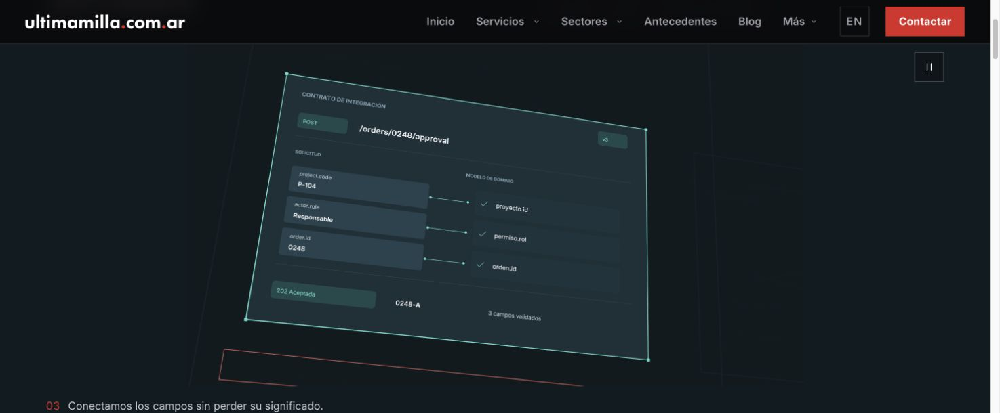
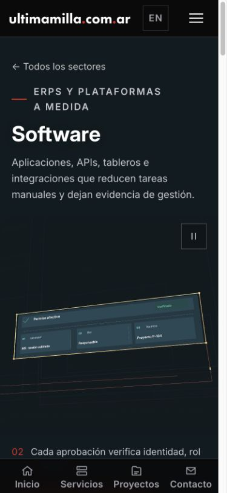

# Software v14 · separación de capas y detalle funcional

## Qué se corrigió

La v13 recuperaba la interfaz de fondo a mitad del relevo entre capítulos: usaba el máximo de dos envolventes parciales como atenuación. También recuperaba el inspector antes de retirar el registro. No era una limitación de Blender: era una decisión equivocada de composición temporal.

La v14 mantiene la interfaz atenuada de forma continua durante la inspección. Contrato y registro tienen entradas y salidas separadas; la vuelta recupera primero el contexto y después el permiso. El validador recorre los 960 fotogramas y rechaza la coincidencia de textos fuertes de contrato/registro, o la recuperación de la interfaz con esos textos activos.

## Riqueza incorporada

- Contrato: método y endpoint, versión, tres correspondencias entre campos de solicitud y dominio, conectores en su canal central, comprobaciones y respuesta con el mismo identificador.
- Registro: orden y proyecto, estado anterior/confirmado, historial con dos eventos vinculados, versión y correlación de solicitud.
- Se conservan pesos distintos para borde principal, detalles y estructura posterior. Los textos de otras capas no se confunden con transparencia del material.
- Encuadre móvil más próximo durante la inspección, sin cambiar la proyección ni deformar el objeto.
- Conexión de la solicitud por debajo de los paneles ampliados; no por encima del historial.

## Iteración propia

1. Prueba 37980507134: enriquecimiento válido, pero la conexión quedaba dentro del panel ampliado y el regreso se vaciaba demasiado. Se corrigieron ambos antes del render final.
2. Prueba 37980913809, autor 7a06e5b4: 19 fotogramas recibidos, incluyendo transiciones y composiciones móvil/escritorio. Se canceló el último trabajador atascado preparando el entorno; no había empezado Blender. El mismo intervalo está incluido en el render completo.
3. Render completo 37981233869: 62 fragmentos correctos y dos fallos preparando el entorno, antes de Blender. Se recuperaron sólo `mobile:0` (37982547830) y `wide:870` (37983726971).
4. Ensamblado completo: 64 fragmentos, 960 fotogramas por composición, 16 segundos a 60 fps. Procedencia idéntica en los tres autores; decodificación completa correcta. Se importaron seis archivos nuevos e inmutables.

## Criterio de comparación

Hill se usa para evaluar jerarquía, material transparente, POV cruzado y continuidad. Ryan/Solvaix aportan criterios de detalle y relaciones entre sistemas, pero no se declara corregida la arquitectura de los demás sectores a partir de una película de Software. La comparación visual debe incluir las transiciones, no sólo los planos estables.

## Verificación final

- Escritorio: 3840 × 2160; móvil: 2160 × 2160; H.264, 60 fps nativos, BT.709. Vídeos de 21,77 MB y 12,05 MB. Los seis assets suman 34.486.489 bytes.
- Preview reconstruida con `UM_SOFTWARE_REVIEW=v14`, disponible en `/software` y compartida con el servicio 104. Registro de producción intacto.
- Navegador Chrome: revisados encuadres a 1490 × 616 y 390 × 844; asset cuadrado en móvil, carga y reproducción autónomas, regreso al inicio del bucle y subtítulos vinculados al reloj. Sin overflow horizontal móvil.
- La cámara conserva el POV cruzado. Los planos estables permiten seguir cada correspondencia y leer el estado/historial sin el texto de otro panel encima. Los relevos usan atenuación breve, no una interrupción del reproductor.
- La isometría existente conserva su recorrido autónomo. No se modificaron los demás sectores ni la campaña protegida.
- `npm run typecheck` y `UM_SOFTWARE_REVIEW=v14 npm run build`: correctos.
- 46 pruebas de software/lifecycle, 23 de integración y la nueva prueba de aislamiento v14: correctas.

## Resultado frente a las referencias

La corrección reduce la confusión de capas y agrega detalle funcional verificable: campos relacionados, identificador común, respuesta, estado anterior y posterior e historial. No equivale a certificar una calidad indistinguible de Hill, Ryan o Solvaix: esa afirmación no está sustentada. En particular, la riqueza del conjunto y la composición de cada transición deben juzgarse en movimiento, no por la resolución o la cantidad de objetos. Esta entrega es una candidata local revisada, sin promoción a producción.

Los fotogramas nativos, validaciones y hashes quedan en `/Volumes/SDTERA/Codex UM25 audits/20261009/software-v14/delivery`.
