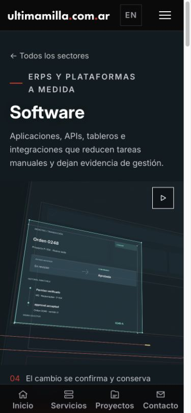
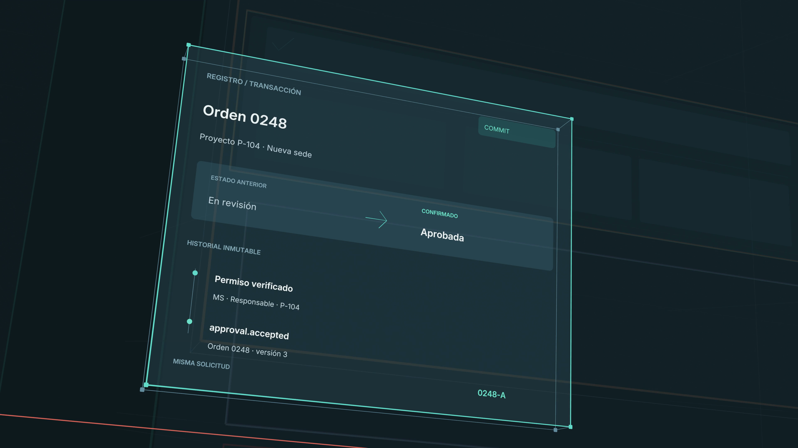

# Software v15 · acciones visibles dentro del sistema

## Problema y cambio

La v14 mejoraba la separación de paneles, pero la animación seguía dependiendo demasiado del recorrido de cámara. La v15 lleva la secuencia a 20 segundos y anima una misma operación: identidad y alcance, correspondencia de campos, validación, confirmación e historial. El identificador 0248-A conecta los mecanismos.

El permiso tiene tres condiciones que se comprueban en orden. En el contrato, los pulsos recorren un canal central reservado y cada comprobación aparece después de su llegada. La respuesta y el contador de campos aparecen después de la tercera comprobación. El registro confirma el cambio después de recibir la solicitud. La vuelta recupera primero las superficies de contexto y después su tipografía.

## Composición

- POV cruzado conservado, con planos posteriores y pequeños separadores que hacen visible el espesor.
- Bordes principales, estructura posterior y separadores internos tienen pesos y opacidades diferentes.
- Las superficies posteriores permanecen sutilmente visibles durante el relevo. Sus textos no atraviesan el mecanismo protagonista.
- La cámara conserva posiciones y velocidades continuas, con reposo al entrar y salir de los planos estables.
- Composiciones nativas separadas para escritorio y móvil; no se estira ni recorta una captura para obtener la otra.

## Correcciones durante la revisión propia

1. Prueba 37985817310: se detectaron siluetas negras de glifos inactivos, formas rellenas residuales y comprobaciones anticipadas. Se corrigieron ocultación, opacidad y secuencia.
2. Prueba 37986243630: el regreso recuperaba la tipografía de la aplicación con el registro todavía en primer plano. Se separaron los tiempos de superficie y texto.
3. Prueba 37986778446: el fotograma 1008 se volvió a revisar en escritorio y móvil; desapareció la superposición de regreso.
4. Autor congelado para secuencia completa: acab5682. El contador de tres campos validados queda vinculado a la tercera comprobación.
5. Secuencia 37987061286: se recuperó `wide:0` con 37987655131 y `wide:870` con 37989192532 (segundo intento). Ambos fallaron preparando el entorno, antes de Blender. Para `wide:840`, cuyo trabajador excedía ampliamente los tiempos de sus vecinos, se lanzó la recuperación acotada 37990409902. Se preservaron todos los fragmentos correctos.

## Comparación con las referencias

Hill es la referencia directa para jerarquía de líneas, POV cruzado, transparencia y fluidez del recorrido. Se revisan también los originales de Ryan y Solvaix para precisión y relaciones entre componentes. No se equipara cantidad de geometría o resolución con calidad visual. Esta modificación corresponde al render de Software; no cambia las isometrías ni acredita mejoras en otros sectores.

## Verificación

- Validador de autor: recorre los 1200 fotogramas y comprueba continuidad de cámara, orden causal de las acciones y separación temporal de textos.
- 71 pruebas de software, ciclo de reproducción e integración: correctas.
- Typecheck: correcto.
- Ensamblado completo: 80 fragmentos, 1200 fotogramas por composición, 20 segundos a 60 fps, H.264. Se verificaron resolución, color, orden, hashes de los tres autores y decodificación completa.
- Escritorio 3840 × 2160: 33.241.173 bytes. Móvil 2160 × 2160: 19.337.805 bytes. Los seis assets suman 53.336.543 bytes, con nombres nuevos e inmutables.
- `UM_SOFTWARE_REVIEW=v15 npm run build`: correcto. Preview reiniciada con la misma bandera.
- `/software` y el servicio 104 devuelven HTTP 200 y seleccionan `software-system-v15`; vídeos y pósteres responden HTTP 200.
- Chrome: revisión integrada en 1490 × 1000 y 390 × 844. Reproducción autónoma, captions sincronizados y reinicio del bucle observados en ambos formatos. El móvil selecciona el archivo cuadrado nativo; sin overflow horizontal.
- Se observaron en navegador el contrato y las comprobaciones de autorización, el registro y el regreso. La revisión nativa incluye los relevos a 7,6 / 12,6 / 16,8 / 18,2 segundos. Los textos del contexto regresan después del registro; quedan superficies transparentes durante el cambio.
- El trabajador original rezagado fue cancelado después de recibir los 80 fragmentos. El render se ejecutó en GitHub Actions, sin Blender local.
- Registro de producción, isometrías y campaña protegida sin cambios en esta entrega.

## Resultado de la comparación

La v15 corrige tres defectos observados al comparar: contenido estático dentro del recorrido, glifos oscuros residuales y superposición de tipografías en la vuelta. Incorpora profundidad posterior y una operación verificable en vez de actividad decorativa. Se contrastaron los originales locales y el vídeo codificado a escala de uso. Esta evidencia describe las mejoras; no constituye una certificación de calidad indistinguible de todas las referencias ni una aprobación de producción.

Vídeos, fotogramas, metadatos y hashes: `/Volumes/SDTERA/Codex UM25 audits/20261009/software-v15/delivery`.

